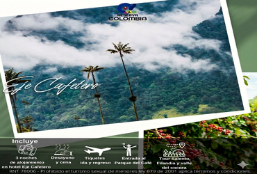
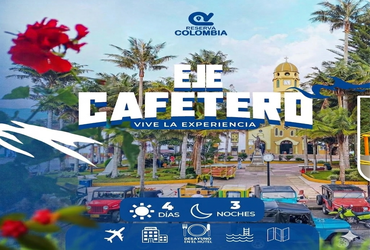
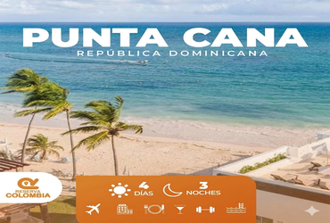

# 📋 PLAN DE SEO ON-PAGE - Reserva Colombia
## Fase 1-5 para Optimización Interna y Posicionamiento

**Documento Creado**: 18 Marzo 2026  
**Prioridad**: Fase 1 (Crítica) → Fase 5 (Futura)  
**Tiempo Estimado Total**: 12-16 horas

---

## ⚡ FASE 1: CRÍTICA (4-5h) - Implementar Primero
### Impacto: 60% del SEO on-page

#### 1.1 Meta Descriptions Únicos por Página
```
Inicio.html:
<meta name="description" content="Reserva Colombia - Agencia de viajes en Quimbaya, Quindío. 
Paquetes turísticos a Eje Cafetero, Punta Cana, Santa Marta, Cartagena y San Andrés. 
Asesoría personalizada en viajes hacia destinos paradisíacos de Colombia.">

Paquetes.html:
<meta name="description" content="Paquetes turísticos en Reserva Colombia. 6 destinos increíbles: 
Eje Cafetero, Punta Cana, Santa Marta, Cartagena, San Andrés y más. 
Incluye tiquetes, hotel, tours. Contáctanos para presupuesto personalizado.">

Galeria.html:
<meta name="description" content="Galería de destinos turísticos de Reserva Colombia. 
Imagenes reales de playas, montañas, ciudades coloniales y experiencias únicas 
en Colombia y el Caribe. ¡Haz clic para ver más!">

Contacto.html:
<meta name="description" content="Contacto Reserva Colombia - Agencia de viajes en Quimbaya, Quindío. 
Teléfono: 300-3501130 | WhatsApp: +57 320 7460992 | Email: reservacolombia@outlook.com. 
Ubicación: Carrera 5 No 11-25. ¡Escribenos!">
```

#### 1.2 Titles Únicos y Descriptivos
```
Inicio.html: <title>Reserva Colombia - Agencia de Viajes en Quimbaya, Quindío</title>

Paquetes.html: <title>Paquetes Turísticos 2026 - Reserva Colombia | 6 Destinos</title>

Galeria.html: <title>Galería de Destinos - Reserva Colombia | Playas, Montañas, Ciudades</title>

Contacto.html: <title>Contacto - Reserva Colombia | Ubicación, Teléfono, WhatsApp</title>
```

#### 1.3 Keywords Meta (Complementario)
```html
<!-- Inicio.html -->
<meta name="keywords" content="agencia de viajes, Quimbaya, Quindío, paquetes turísticos, 
viajes Colombia, Eje Cafetero, Punta Cana, turismo responsable">

<!-- Paquetes.html -->
<meta name="keywords" content="paquetes turísticos, tours Colombia, viajes Eje Cafetero, 
Punta Cana, Santa Marta, Cartagena, San Andrés, precio tours">

<!-- Galeria.html -->
<meta name="keywords" content="galería de viajes, destinos turísticos, fotos playas, 
montañas Colombia, ciudades coloniales, experiencias turísticas">

<!-- Contacto.html -->
<meta name="keywords" content="contacto agencia viajes, Reserva Colombia, teléfono, 
WhatsApp, email, ubicación Quimbaya, asesoría viajes">
```

#### 1.4 Corregir Atributo lang (HTML Tag)
```html
<!-- ANTES (todas las páginas): -->
<html lang="en">

<!-- DESPUÉS: -->
<html lang="es">
```
**Razón**: El contenido está en español. Google indexará mejor.

#### 1.5 Agregar H1 Principal (Cada Página)
```html
<!-- Inicio.html: después del HOME SECTION -->
<h1 style="display: none;">Reserva Colombia - Agencia de Viajes en Quimbaya, Quindío</h1>

<!-- Paquetes.html -->
<h1 style="display: none;">Paquetes Turísticos - 6 Destinos Increíbles</h1>

<!-- Galeria.html -->
<h1 style="display: none;">Galería de Destinos Turísticos de Reserva Colombia</h1>

<!-- Contacto.html -->
<h1 style="display: none;">Contacto - Reserva Colombia Agencia de Viajes</h1>
```
**Nota**: display: none para no afectar diseño. ES SOLO SEMÁNTICA.

#### 1.6 Open Graph Tags (Redes Sociales)
```html
<!-- Agregar en TODAS las páginas, dentro de <head> -->

<!-- Inicio.html -->
<meta property="og:title" content="Reserva Colombia - Agencia de Viajes en Quimbaya">
<meta property="og:description" content="Paquetes turísticos a destinos paradisíacos. Eje Cafetero, Punta Cana, Santa Marta y más.">
<meta property="og:image" content="https://reservacolombia.com.co/assets/img/reserva-colombia-logo_1.jpg">
<meta property="og:url" content="https://reservacolombia.com.co">
<meta property="og:type" content="website">
<meta name="twitter:card" content="summary_large_image">

<!-- Similar para Paquetes.html, Galeria.html, Contacto.html -->
```

---

## 🔍 FASE 2: ALTA PRIORIDAD (3-4h)
### Impacto: 25% del SEO on-page

#### 2.1 Schema.json (Structured Data)
**Archivo nuevo**: `assets/json/schema.json`

```json
{
  "@context": "https://schema.org",
  "@type": "Organization",
  "name": "Reserva Colombia",
  "url": "https://reservacolombia.com.co",
  "logo": "https://reservacolombia.com.co/assets/img/reserva-colombia-logo_1.jpg",
  "description": "Agencia de viajes en Quimbaya, Quindío. Paquetes turísticos a destinos paradisíacos.",
  "address": {
    "@type": "PostalAddress",
    "streetAddress": "Carrera 5 No. 11-25",
    "addressLocality": "Quimbaya",
    "addressRegion": "Quindío",
    "postalCode": "63245",
    "addressCountry": "CO"
  },
  "telephone": "+573003501130",
  "email": "reservacolombia@outlook.com",
  "sameAs": [
    "https://www.facebook.com/reservacolombiaoficial",
    "https://www.instagram.com/reservacolombiaoficial"
  ]
}
```

**Incorporar en HEAD de cada página:**
```html
<script type="application/ld+json">
{
  "@context": "https://schema.org",
  "@type": "Organization",
  "name": "Reserva Colombia",
  ...
}
</script>
```

#### 2.2 Sitemap.xml
**Archivo nuevo**: `sitemap.xml` (en raíz del proyecto)

```xml
<?xml version="1.0" encoding="UTF-8"?>
<urlset xmlns="http://www.sitemaps.org/schemas/sitemap/0.9">
  <url>
    <loc>https://reservacolombia.com.co/Inicio.html</loc>
    <lastmod>2026-03-18</lastmod>
    <changefreq>weekly</changefreq>
    <priority>1.0</priority>
  </url>
  <url>
    <loc>https://reservacolombia.com.co/Paquetes.html</loc>
    <lastmod>2026-03-18</lastmod>
    <changefreq>weekly</changefreq>
    <priority>0.9</priority>
  </url>
  <url>
    <loc>https://reservacolombia.com.co/Galeria.html</loc>
    <lastmod>2026-03-18</lastmod>
    <changefreq>monthly</changefreq>
    <priority>0.8</priority>
  </url>
  <url>
    <loc>https://reservacolombia.com.co/Contacto.html</loc>
    <lastmod>2026-03-18</lastmod>
    <changefreq>monthly</changefreq>
    <priority>0.7</priority>
  </url>
</urlset>
```

#### 2.3 robots.txt
**Archivo nuevo**: `robots.txt` (en raíz)

```txt
User-agent: *
Allow: /
Sitemap: https://reservacolombia.com.co/sitemap.xml

# Bloquear directorios sensibles (si existieran)
Disallow: /admin/
Disallow: /.git/
```

---

## 📐 FASE 3: MEDIA PRIORIDAD (2-3h)
### Impacto: 10% del SEO on-page

#### 3.1 Canonical Tags
```html
<!-- Agregar en TODAS las páginas, después de meta description -->

<!-- Inicio.html -->
<link rel="canonical" href="https://reservacolombia.com.co/Inicio.html">

<!-- Paquetes.html -->
<link rel="canonical" href="https://reservacolombia.com.co/Paquetes.html">

<!-- Galeria.html -->
<link rel="canonical" href="https://reservacolombia.com.co/Galeria.html">

<!-- Contacto.html -->
<link rel="canonical" href="https://reservacolombia.com.co/Contacto.html">
```

#### 3.2 Mejorar Alt Text en Galería
```html
<!-- ANTES: -->


<!-- DESPUÉS (descriptivo): -->



<!-- ... etc para las 9 imágenes -->
```

#### 3.3 Optimizar Google Fonts (HTTPS)
```html
<!-- ANTES: -->
<link href='http://fonts.googleapis.com/css?family=Open+Sans' rel='stylesheet' type='text/css'>

<!-- DESPUÉS: -->
<link href='https://fonts.googleapis.com/css?family=Open+Sans' rel='stylesheet' type='text/css'>
```

---

## ⚡ FASE 4: BAJA PRIORIDAD (2h) - Futuro
### Impacto: 3% del SEO on-page

#### 4.1 Lazy Loading en Imágenes
```html
<!-- Agregar atributo loading a imágenes pesadas -->

```

#### 4.2 Scripts con async/defer
```html
<!-- ANTES: -->
<script src="plugins/jquery-1.10.2.js"></script>

<!-- DESPUÉS: -->
<script src="plugins/jquery-1.10.2.js" defer></script>
```

---

## 📊 FASE 5: FUTURO (Próximas Sesiones)
- Optimización de imágenes (WebP, compresión)
- Blog de viajes (SEO + Traffic)
- Sistema de reseñas (schema.org/Review)
- Breadcrumbs
- FAQs Schema
- Redirección de URLs antiguas

---

## ✅ CHECKLIST DE IMPLEMENTACIÓN FASE 1

- [ ] Actualizar meta descriptions (4 páginas)
- [ ] Crear titles únicos (4 páginas)
- [ ] Agregar keywords meta (4 páginas)
- [ ] Cambiar lang="en" a lang="es" (4 páginas)
- [ ] Agregar H1 hidden (4 páginas)
- [ ] Agregar Open Graph tags (4 páginas)
- [ ] Commit & Push a GitHub
- [ ] Testear con Google Search Console (validator)

**Tiempo Fase 1**: ~4-5 horas  
**Beneficio**: 60% mejora en SEO on-page  
**ROI**: Alto (mejora CTR, indexación, rankings)

---

## 🧪 HERRAMIENTAS PARA VALIDAR

1. **Google Safe Browsing**: https://transparencyreport.google.com/safe-browsing
2. **Schema.org Validator**: https://validator.schema.org/
3. **Facebook OG Debugger**: https://developers.facebook.com/tools/debug/
4. **Google PageSpeed**: https://pagespeed.web.dev/
5. **Lighthouse (Chrome DevTools)**

---

**Próxima Acción**: Implementar Fase 1 (crítica) en la próxima sesión.
